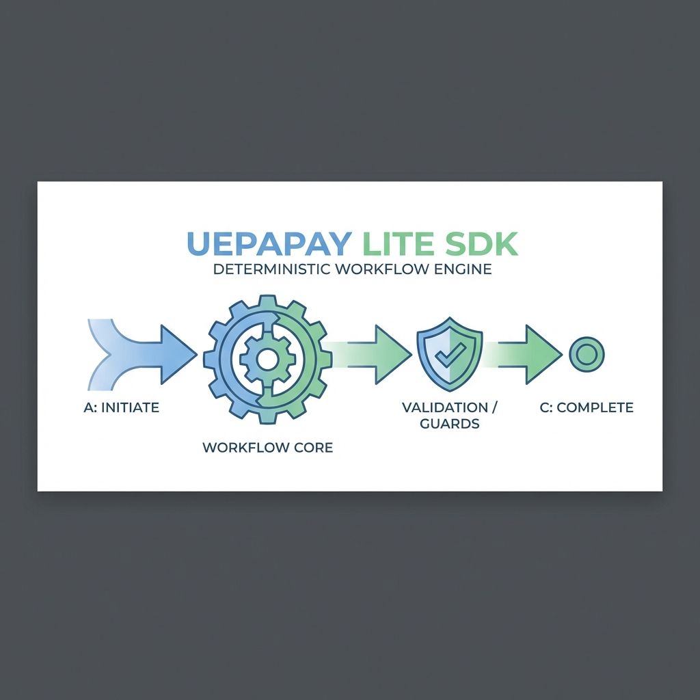

# Workflow/State Engine Library

A lightweight, deterministic, and framework-agnostic state machine engine designed for validating workflow transitions in TypeScript applications.

## Table of Contents
- [Features](#features)
- [Installation](#installation)
- [Architecture](#architecture)
- [Usage](#usage)
  - [Defining a Workflow](#defining-a-workflow)
  - [Validating Transitions](#validating-transitions)
  - [Using Guards](#using-guards)
- [API Reference](#api-reference)
- [Testing](#testing)

## Features
- **Deterministic Validation**: Pure business logic engine that validates transitions before any side effects occur.
- **Stateless Design**: No internal state persistence; fully compatible with serverless environments (e.g., Cloudflare Workers).
- **Type Safety**: Built with strict TypeScript, supporting generic contexts for domain-specific validation.
- **Guard System**: Flexible guard functions to enforce complex transition rules.
- **Zero Dependencies**: Core logic depends only on standard TypeScript/JavaScript.

## Installation

This project is currently structured as an internal library standard. To use it within this repository:

1. Import directly from `src/workflow-engine`.
2. Ensure you have the necessary dev dependencies installed:
   ```bash
   npm install
   ```

## Architecture
The library is modular and composed of the following parts:

- **Core (`src/workflow-engine/core`)**: Contains the `WorkflowEngine` class, the main entry point.
- **Validators (`src/workflow-engine/validators`)**: Logic for validating states and transitions.
- **Types (`src/workflow-engine/types`)**: strictly typed interfaces.
- **Errors (`src/workflow-engine/errors`)**: Domain-specific error classes.

## Usage

### Defining a Workflow
Define your states, transitions, and rules using the `WorkflowDefinition` interface.

```typescript
import { createWorkflow, WorkflowDefinition } from './src/workflow-engine';

interface OrderContext {
  orderId: string;
  amount: number;
}

const orderWorkflow: WorkflowDefinition<OrderContext> = {
  name: 'OrderProcessing',
  initialState: 'PENDING',
  states: {
    PENDING: { name: 'PENDING' },
    PAID: { name: 'PAID' },
    CANCELLED: { name: 'CANCELLED', isTerminal: true }
  },
  transitions: [
    { from: 'PENDING', to: 'PAID', label: 'Process Payment' },
    { from: 'PENDING', to: 'CANCELLED', label: 'Cancel Order' }
  ]
};

const engine = createWorkflow(orderWorkflow);
```

### Validating Transitions
Check if a transition is allowed before executing business logic.

```typescript
const context = { orderId: '123', amount: 100 };
const result = engine.validate('PENDING', 'PAID', context);

if (result.allowed) {
  console.log('Transition allowed');
  // Proceed with database updates, etc.
} else {
  console.error('Transition blocked:', result.reason);
}
```

### Using Guards
Guards are functions that return `true` (allowed) or a `ValidationResult` (denied).

```typescript
transitions: [
  {
    from: 'PENDING',
    to: 'PAID',
    guards: [
      ({ context }) => {
        if (context.amount <= 0) {
          return { allowed: false, reason: 'Amount must be positive' };
        }
        return true;
      }
    ]
  }
]
```

## API Reference

### `createWorkflow<TContext>(definition)`
Factory function to create a new `WorkflowEngine` instance.

### `engine.validate(from, to, context)`
Returns a `ValidationResult`:
```typescript
{
  allowed: boolean;
  reason?: string;
  errors?: string[];
}
```

### `engine.assertTransition(from, to, context)`
Throws an `InvalidTransitionError` if the transition is not allowed. Useful for fail-fast scenarios.

### `engine.getAllowedTransitions(from, context)`
Returns a list of valid next states based on the current state and context.

## Testing
Run the included unit tests using Vitest:

```bash
npm test
```

## License
[ISC](LICENSE)
